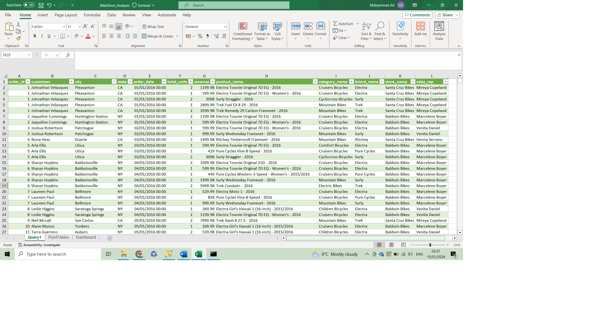
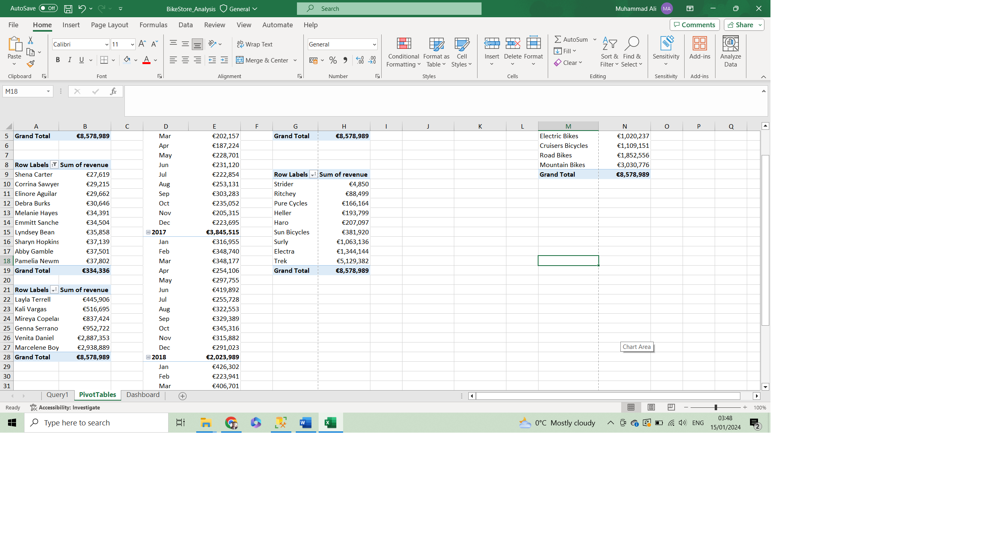
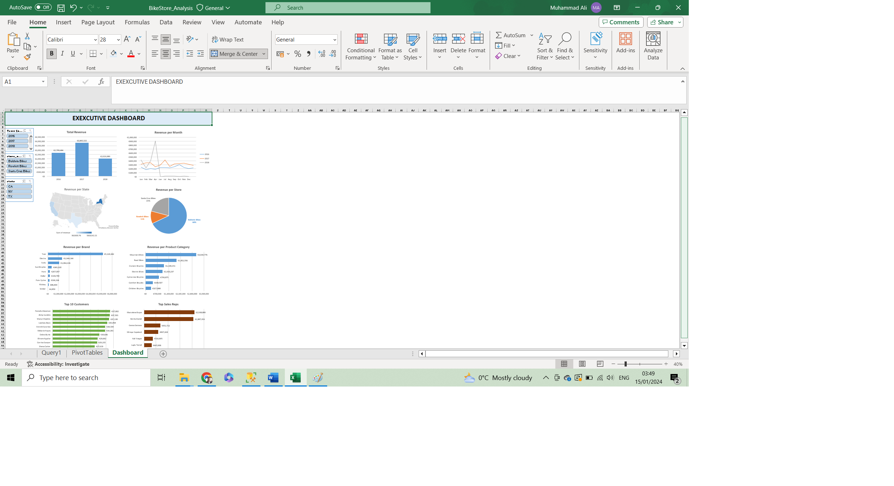

# Bike Stores Sales Analysis

**Dataset:** [Bike Store SQL DB](https://shorturl.at/fiDQ8)

## Preview:
The folder named **SQL-Server-Sample-Database** contains the downloaded data. Run **BikeStores Sample Database - create objects** followed by **BikeStores Sample Database - load data** in MS SQL Server Management Studio to load the database.

Based on the problem statement for analysis given below, following query was developed to pull the data from all tables in the database.
```
SELECT
	ord.order_id,
	CONCAT(cus.first_name,' ', cus.last_name) AS 'customers',
	cus.city,
	cus.state,
	ord.order_date,
	SUM(ite.quantity) AS  'total_units',
	SUM(ite.quantity * ite.list_price) AS 'revenue',
	pro.product_name,
	cat.category_name,
	bra.brand_name,
	sto.store_name,
	CONCAT(sta.first_name,' ', sta.last_name) AS 'sales_rep'
FROM sales.orders ord
JOIN sales.customers cus
ON ord.customer_id = cus.customer_id
JOIN sales.order_items ite
ON ord.order_id = ite.order_id
JOIN production.products pro
ON ite.product_id = pro.product_id
JOIN production.categories cat
ON cat.category_id = pro.category_id
JOIN sales.stores sto
ON sto.store_id = ord.store_id
JOIN sales.staffs sta
ON ord.staff_id = sta.staff_id
JOIN production.brands bra
ON pro.brand_id = bra.brand_id
GROUP BY
	ord.order_id,
	CONCAT(cus.first_name,' ', cus.last_name),
	cus.city,
	cus.state,
	ord.order_date,
	pro.product_name,
	cat.category_name,
	bra.brand_name,
	sto.store_name,
	CONCAT(sta.first_name,' ', sta.last_name)
```
Resulting data was imported in MS Excel using a connection to database. It contains 4723 Rows and look like this.

This file is stored by name **BikeStore_Analysis.xlsx**. This file contains three sheets. First sheet contains data. Second sheet named **Pivot Tables** contains all the data transformations done for analysis using pivot tables and looks as follows.

Third sheet named **Dashboard** contains a dashboard with charts, slicers and filters to present final findings and looks like this.


## Tableau Dashboard
Here is the tableau dashboard. [Click Here](https://public.tableau.com/app/profile/muhammad.ali5897/viz/Bike_Store_Sales/Dashboard1) to interact real time with this dashboard and explore the data.


## Technologies Used:
* SQL
* MS SQL Server Management Studio
* MS Excel
* Pivot Tables
* Slicers
* Tableau

## Analysis Process:
Following steps were taken for the project:
1. Understand the problem.
   * Condition of the sales activity within the company.
   * Gain insights into the various trends happening in sales volume over 2016 to 2018.
   * Revenues per region, per store, per product category and per brand.
   * List of top customers and sales reps.
2. Collect and gather data.
   * Develop SQL query to pull data from company’s SQL database.
   * Pull data from SQL Server to csv.
   * Connect query with MS Excel for analysis.
3. Clean the data.
4. Gather and analyse data.
   * Perform data transformations using Pivot Tables.
   * Develop Charts & Executive Dashboard.
   * Create a slicer to filter Dashboard reports.
5. Interpret the results.

## How to load the data?
Load the database in MS SQL Server Management Studio: 
1.	Open SQL server, create a new database and name it BikeStores.
2.	Select the new BikeStores database in the SQL server.
3.	Open the zip downloaded from the link I provided.
4.	Open the 'create objects' query file and then execute it in the SQL server for the BikeStores database.
5.	Open the 'load data' query file and then execute it in the SQL server for the BikeStores database.


